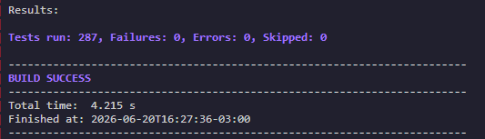

# 🍔 Hamburgueria

[]()
[]()
[]()
[]()

**Disciplina:** Arquitetura e Projeto de Software
**Autor:** Igor Gabriel Rodrigues

## 🎯 Sobre o Projeto

Este repositório contém a modelagem e implementação de um ecossistema completo para uma Hamburgueria. O objetivo técnico central foi integrar **23 Padrões de Projeto (GoF)** em uma arquitetura unica.

---

## 🏗️ Arquitetura e Padrões Aplicados

O sistema está dividido em 4 macros-módulos. Cada padrão não apenas existe isoladamente, mas atua como uma engrenagem fundamental no fluxo do sistema.

### 1. Módulo de Catálogo e Atendimento (A Vitrine)

Focado na exibição de produtos, navegação do cliente e otimização de performance.

- **Composite:** Estruturação do cardápio em formato de árvore (Categorias e Itens).
- **Iterator:** Navegação linear e segura pela árvore do cardápio.
- **Abstract Factory:** Criação de famílias consistentes de produtos (ex: Combos Artesanais vs. Combos Smash).
- **Prototype:** Clonagem de pedidos complexos para o recurso "Repetir Último Pedido".
- **Flyweight:** Otimização pesada de memória compartilhando imagens em Base-64 e tabelas nutricionais.

### 2. Módulo de Montagem e Carrinho (A Intenção de Compra)

Gerenciamento de fila de ações, personalização e garantia de estado do usuário.

- **Builder:** Construção passo a passo de hambúrgueres 100% customizados.
- **Decorator:** Extensão dinâmica de itens (adicionais como bacon e cheddar) somando preços e descrições em tempo de execução.
- **Command:** Encapsulamento de ações do carrinho, permitindo filas e o botão "Desfazer".
- **Memento:** Salvamento e restauração segura do estado do carrinho contra falhas de conexão.
- **Facade:** Interface unificada e simplificada que isola a complexidade do Checkout.

### 3. Módulo Financeiro e Pagamento (O Motor de Regras)

Processamento matemático dinâmico, regras de negócio e proteção de gateway.

- **Strategy:** Delegação do cálculo de precificação (ex: Taxas Noturnas, Promoções).
- **Interpreter:** Leitura e resolução de expressões matemáticas em formato de texto para compor regras de negócio dinâmicas.
- **Bridge:** Desacoplamento entre a abstração do método de pagamento (Pix, Cartão) e a API externa processadora (Stripe).
- **Proxy:** Camada de segurança e _rate limiting_ antes de acessar o gateway real de pagamento.

### 4. Módulo de Cozinha e Monitoramento (O Coração Reativo e Logística)

Orquestração assíncrona, garantia de qualidade e comunicação externa.

- **Singleton:** Barramento global de eventos (`EventBus`) para comunicação assíncrona entre Pagamento e Cozinha.
- **Mediator:** Maestro da cozinha que ouve os eventos e coordena as estações e o controle de qualidade.
- **State:** Máquina de estados blindada gerenciando o ciclo de vida do Pedido (Pendente -> Em Preparo -> Pronto -> Despachado).
- **Factory Method:** Instanciação dinâmica do equipamento correto (Chapa, Fritadeira) baseado no tipo do insumo.
- **Template Method:** Definição imutável do algoritmo de preparo (separar ingredientes, preparar, embalar).
- **Chain of Responsibility:** Corrente de controle de qualidade rigoroso (Temperatura -> Apresentação -> Embalagem).
- **Observer:** Atualização reativa de telas e apps de clientes quando o estado do pedido é alterado.
- **Adapter:** Tradução do objeto complexo do pedido interno para o Payload JSON exigido pela API da Loggi (transportadora).
- **Visitor:** Motor de extração de relatórios (ex: Lucratividade) varrendo a árvore do Composite sem alterar o código dos itens.

---

## 🧪 Suíte de Testes e Qualidade

O projeto conta com um total de **287 casos de testes executados com sucesso** via JUnit 5.



Regras rigorosas aplicadas à engenharia de testes:

1. **Isolamento Total:** Garantia de que nenhuma dependência externa quebre o teste unitário.
2. **Single Assert Concept:** Cada caso de teste valida estritamente **um** comportamento ou mudança de estado.
3. **Ausência de Lógica de Controle:** Os testes seguem um fluxo linear absoluto (Given-When-Then), sem a presença de `if`, `for` ou `switch`, garantindo que o teste não introduza novos bugs.

---

## Diagrama


## 🚀 Como Executar

### Pré-requisitos

- Java JDK 17+
- Apache Maven

### Compilação e Testes

Para rodar toda a suíte de testes de forma automatizada e verificar a integridade da arquitetura, execute na raiz do projeto:

```bash
mvn clean test
```
